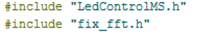

<br>

<p align="center"></p>
<h1 align="center">Arduino Equalizer</h1> <p
align="center">🎶 Simple equalizer with your own hands. The principle of operation of the equalizer is based on the Fourier transform.</p>

---

[](https://www.buymeacoffee.com/kraloveckey)

[](https://t.me/cyber_notes)

---

## Components

Since we try to make the device as accessible and simple as possible, we will use the following components:

- Arduino Nano V3 microcontroller on AVR Atmega168 chip or another.
- 3pin Voice Sound Detection Sensor Module KY-037 High Sensitivity Microphone DIY Intelligent Smart Vehicle Robot Car.
- LED matrix 8x8 + driver MAX7219 - small 32x32mm.
- You just need to buy some more dupont jumper wires, and you will assemble your own audio frequency spectrum analyzer without using a soldering iron. 
  
---

## Software and Configuration

1. Download and install the [Arduino IDE](https://www.arduino.cc/en/software). This is an environment for simple programming in C, as it is widely distributed is not difficult to find a working simple library for any commercially available module.

2. Download and install the [COM port driver](./assets/DRIVER_CH340.zip) which the computer will use to communicate with your device, our Arduino Nano V3 board uses the CH340 chip. If everything was successful after connecting your microcontroller in USB in the device manager you will see the following:

```shell
Ports (COM and LPT) --> USB-SERIAL CH340 (COM3)
```

3. Start the Arduino IDE. Connect the Microcontroller to USB. Click on `Tools` and click on `Board` and then `Processor`.
   
4. Next, in the same item `Tools` in the `Port` tab, select the COM port under which your device is detected in the computer. For example, the device hangs on the 3rd COM port, as in the Device Manager after driver installation.

5. Direct programming, everything is set up and you can write code. Since we use matrix LED display and fast Fourier transforms we need to add these libraries to the Arduino IDE, for this purpose we download  [fix_fft.zip](./assets/fix_fft.zip) and [LedControlMS.zip](./assets/LedControlMS.zip).
   
6. Then select `Sketch > Include Library > Add .ZIP Library`. At the top of the drop down list, select the option to `Add . ZIP Library`.
   
7. And in the opened explorer window add both downloaded zip-archives one by one, after adding them close and reopen Arduino IDE. And copy the following code into the window or download and open [this](./equalizer.ino) file:

```cpp
#include "LedControlMS.h"
#include "fix_fft.h"

char im[128];
char data[128];
int i = 0;
int j = 0;
int k = 0;
int l0;
int l1;
int l2;
int l3;
int l4;
int l5;
int l6;
int l7;
LedControl lc = LedControl(12, 11, 10, 1);
void setup() {
  ADCSRA = (1 << ADEN) | (1 << ADPS0) | (0 << ADPS1) | (1 << ADPS2); // sps=500k ~f=10k
  lc.shutdown(0, false);
  /* Set the brightness to a medium values */
  lc.setIntensity(0, 1);
  /* and clear the display */
  lc.clearDisplay(0);
  pinMode(A0, INPUT);
}
void loop() {
  for (i = 0; i < 128; i++) {

    if (analogRead(A0) > 20) {
      data[i] = analogRead(A0) / 10;
    } else {
      data[i] = 0;
    }
    im[i] = 0;
  };
  fix_fft(data, im, 7, 0);

  for (i = 0; i < 64; i++) {
    data[i] = sqrt(data[i] * data[i] + im[i] * im[i]);
    data[i] = map(data[i], 0, 30, 0, 32);
  };
  l0 = (data[0] + data[1] + data[2] + data[3] + data[4] + data[5] + data[6] + data[7]) / 8;
  l1 = (data[8] + data[9] + data[10] + data[11] + data[12] + data[13] + data[14] + data[15]) / 3;
  l2 = (data[16] + data[17] + data[18] + data[19] + data[20] + data[21] + data[22] + data[23]) / 2;
  l3 = (data[24] + data[25] + data[26] + data[27] + data[28] + data[29] + data[30] + data[31]) / 2;
  l4 = (data[32] + data[33] + data[34] + data[35] + data[36] + data[37] + data[38] + data[39]) / 2;
  l5 = (data[40] + data[41] + data[42] + data[43] + data[44] + data[45] + data[46] + data[47]) / 2;
  l6 = (data[48] + data[49] + data[50] + data[51] + data[52] + data[53] + data[54] + data[55]) / 2;
  l7 = (data[56] + data[57] + data[58] + data[59] + data[60] + data[61] + data[62] + data[63]) / 2;
  i = 0;
  for (i = 0; i < l0; i++) {
    lc.setLed(0, 0, i, true);
  }
  i = 0;
  for (i = 0; i < l1; i++) {
    lc.setLed(0, 1, i, true);
  }
  i = 0;
  for (i = 0; i < l2; i++) {
    lc.setLed(0, 2, i, true);
  }
  i = 0;
  for (i = 0; i < l3; i++) {
    lc.setLed(0, 3, i, true);
  }
  i = 0;
  for (i = 0; i < l4; i++) {
    lc.setLed(0, 4, i, true);
  }
  i = 0;
  for (i = 0; i < l5; i++) {
    lc.setLed(0, 5, i, true);
  }
  i = 0;
  for (i = 0; i < l6; i++) {
    lc.setLed(0, 6, i, true);
  }
  i = 0;
  for (i = 0; i < l7; i++) {
    lc.setLed(0, 7, i, true);
  }
  i = 0;

  delay(50);
  lc.clearDisplay(0);
}
```

8. If the libraries are connected correctly, the code lines will be highlighted, as here:

<p align="center"></p>

9. One of the most important steps is assembling the components, check the connection twice! so that you don't burn anything and wonder `why it doesn't work afterwards?`.

<p align="center"></p>

10. Once assembled, you can stick everything in a suitable enclosure if you want.

<p align="center"></p>
<p align="center"></p>

11. If all steps are done correctly, with the microcontroller connected, you can press the `Sketch -> Upload` button, after pressing it, the sketch (this is the name of the code written in the Arduino IDE) will be compiled (or not, it will generate an error, most likely due to an incorrect driver or not connected device) and flash. A corresponding message will be displayed in the console.

12. That's all, you can play with your own device, understand the code, make your own changes and improve the program. If the device is flashed normally, but does not work correctly, you can try to turn the adjustment resistor (potentiometer) on the microphone module.

13. Device in action:
    

